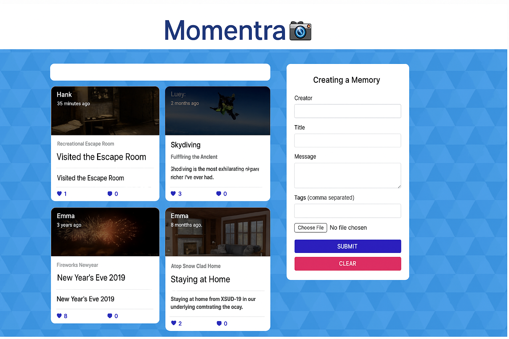

# 📸 Momentra – Share Your Moments, Your Way

Momentra is a modern full-stack social media application where users can create, view, and interact with memorable life events. Designed with the MERN stack and a clean, engaging UI, it allows users to capture and share experiences in a simple, elegant way.



---

## Key-Features

📝 Post Memories  
Built using React functional components and controlled forms. The post data is submitted using Axios to a Node.js + Express API and saved in MongoDB using Mongoose models.

📷 Image Upload Support  
Enabled via the react-file-base64 package. Images are encoded directly in the browser and included as base64 strings in the request payload.

👍 Like & Delete Functionality  
Implemented using Redux actions and reducers. These trigger Express API calls that modify data in MongoDB and update the UI in real-time.

🕒 Timestamped Posts  
Formatted using Moment.js, which converts MongoDB's ISO timestamps into readable formats like “3 days ago.”

Smart Tagging  
Tag input is split using commas and stored in MongoDB. Tags are later rendered dynamically using React, enhancing memory filtering and search.

---

## Tech Stack

Frontend: React, Redux, Material-UI, Axios  
Backend: Node.js, Express.js  
Database: MongoDB with Mongoose  
Image Handling: react-file-base64  
State Management: Redux with Redux Thunk  
Date Formatting: Moment.js  
Styling: CSS Modules, Material-UI

---

## UI/UX Highlights

- Responsive card layout using Material-UI Grid  
- Controlled form input with live image preview  
- Interactive buttons with real-time feedback  
- Clean and intuitive user flows for post creation and browsing

---

## Why This Project Stands Out

Momentra demonstrates a full-stack MERN workflow with real-time UI updates and clean architectural practices. This project showcases:

- Scalable, modular React components  
- Full CRUD operations with secure Express routes  
- Proper use of Redux for global state management  
- Integration of file handling and time formatting libraries  
- A clean, responsive UI using a component-based design system

---

## Getting Started 

### 1. Clone the Repository

```bash
git clone https://github.com/tasnimezaz/Momentra.git
cd Momentra
